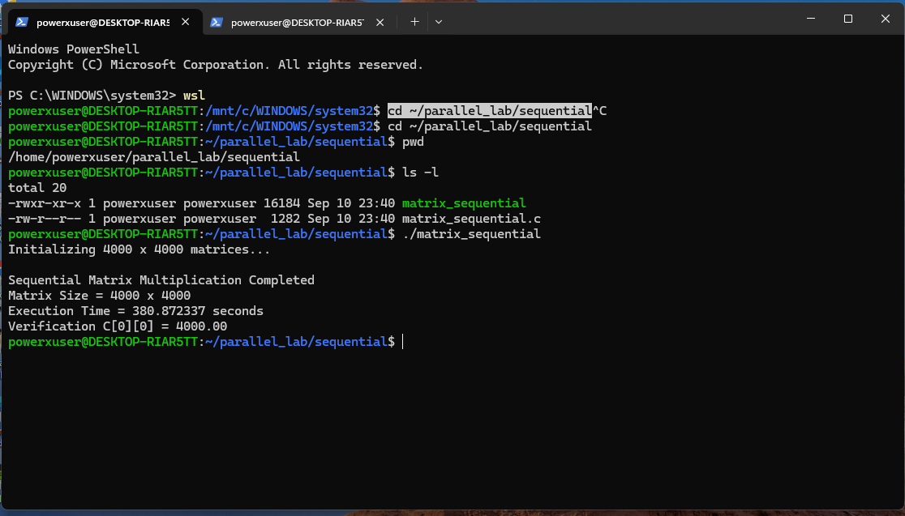
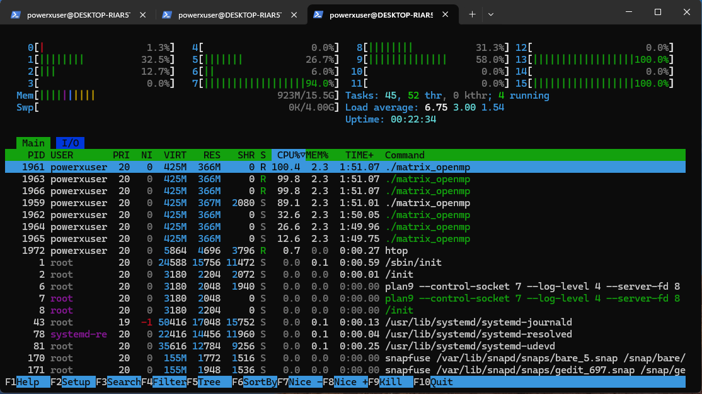
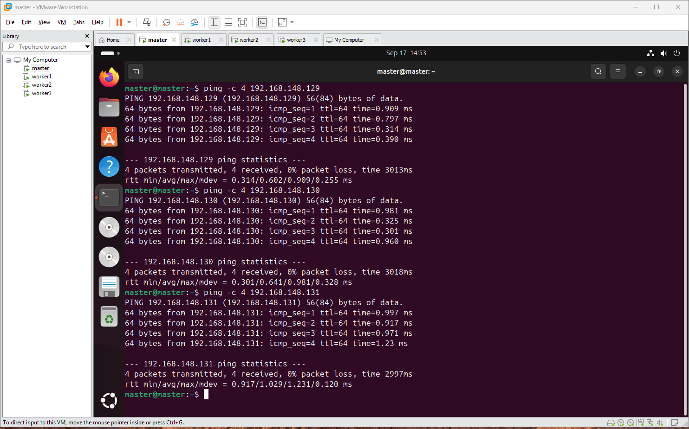
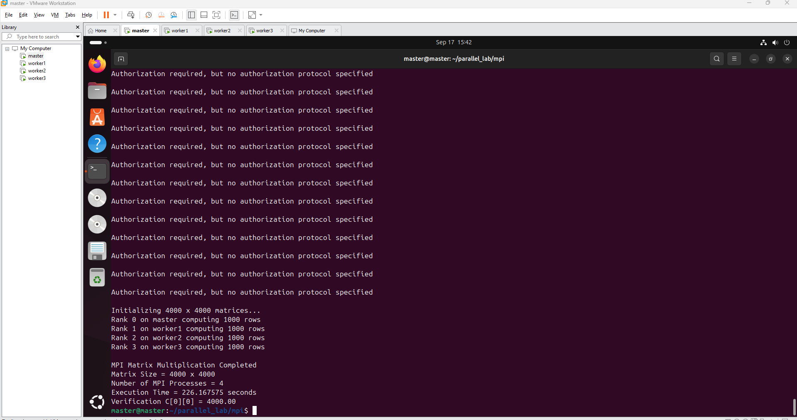

# Parallel and GPU Computing Laboratory (PGC Lab)

This repository contains source code, execution workflows, and benchmark results for the **Parallel & GPU Computing Lab** experiments.

---

## 📌 Experiment 1: Parallel Matrix Multiplication ($4000 \times 4000$)

This experiment evaluates and compares the performance of a **$4000 \times 4000$ Matrix Multiplication** ($C = A \times B$) across four computing paradigms:
1. **Sequential CPU (Baseline)**
2. **OpenMP (Shared Memory Parallelism)**
3. **MPI (Distributed Memory Parallelism across 4 Virtual Machines)**
4. **CUDA (GPU Parallel Acceleration)**

All elements of matrices $A$ and $B$ are initialized to `1.0`. Thus, the expected verification result for element $C[0][0]$ across all implementations is **`4000.00`**.

---

## 📊 Performance Comparison & Results

| Model | Paradigm / Environment | Hardware & Resources | Execution Time | Speedup | Verification $C[0][0]$ |
| :--- | :--- | :--- | :--- | :--- | :--- |
| **Sequential** | Single CPU Core (WSL2 Ubuntu) | 1 CPU Core | `244.12` s | $1.00\times$ | `4000.00` |
| **OpenMP** | Shared-Memory Multi-threading | 8 CPU Threads | `30.83` s | $7.92\times$ | `4000.00` |
| **MPI** | Distributed-Memory Processes | 4 VMs / Ranks (1 Master + 3 Workers) | `92.98` s | $2.63\times$ | `4000.00` |
| **CUDA** | GPU Kernel Threads | NVIDIA RTX 4500 Ada | `0.165` s (Kernel: `0.146` s) | $1479.48\times$ | `4000.00` |

$$\text{Speedup} = \frac{\text{Sequential Execution Time}}{\text{Parallel Execution Time}}$$

---

## 📁 Repository Structure

```
PGC_Lab/
├── README.md
├── .gitignore
├── src/
│   ├── sequential/
│   │   └── matrix_sequential.c
│   ├── openmp/
│   │   └── matrix_openmp.c
│   ├── mpi/
│   │   ├── matrix_mpi.c
│   │   └── mpi_send_recv.c
│   └── cuda/
│       └── matrix_cuda.cu
├── images/
│   ├── sequential_result.png
│   ├── openmp_htop.png
│   ├── mpi_ping.png
│   ├── mpi_send_recv.png
│   └── mpi_result.png
└── docs/
    ├── Experiment_1_Lab_Manual.docx
    └── MPI_Matrix_Multiplication_Manual.pdf
```

---

## 🛠️ Execution Steps & Screenshots

### 1. Sequential Matrix Multiplication
- **Directory**: `src/sequential`
- **Compiler**: GCC
```bash
cd src/sequential
gcc -O2 matrix_sequential.c -o matrix_sequential
./matrix_sequential
```


---

### 2. OpenMP Parallel Matrix Multiplication
- **Directory**: `src/openmp`
- **Compiler Flags**: `-fopenmp`
```bash
cd src/openmp
gcc -O2 -fopenmp matrix_openmp.c -o matrix_openmp
export OMP_NUM_THREADS=8
./matrix_openmp
```


---

### 3. MPI Distributed Matrix Multiplication
- **Directory**: `src/mpi`
- **Cluster**: 1 Master + 3 Workers (`master`, `worker1`, `worker2`, `worker3`)

#### Network Ping Test:
```bash
ping -c 4 192.168.125.129
ping -c 4 192.168.125.130
ping -c 4 192.168.125.131
```


#### MPI Communication Verification:
```bash
mpicc mpi_send_recv.c -o mpi_send_recv
scp mpi_send_recv worker1:~/
scp mpi_send_recv worker2:~/
scp mpi_send_recv worker3:~/
mpirun -np 4 --hostfile hosts ./mpi_send_recv
```


#### Distributed Matrix Multiplication Execution:
```bash
mpicc -O2 matrix_mpi.c -o matrix_mpi
scp matrix_mpi worker1:~/
scp matrix_mpi worker2:~/
scp matrix_mpi worker3:~/
mpirun -np 4 --hostfile hosts ./matrix_mpi
```


---

### 4. CUDA GPU Matrix Multiplication
- **Directory**: `src/cuda`
- **Compiler**: NVCC (`nvcc`)
```bash
cd src/cuda
nvcc -O2 matrix_cuda.cu -o matrix_cuda
./matrix_cuda
```
- **Grid Configuration**: $250 \times 250$ blocks
- **Block Configuration**: $16 \times 16$ threads (256 threads/block)
- **Total GPU Threads**: $16,000,000$

---

## 📚 Lab Manuals
Detailed lab reference manuals are located in the [`docs/`](docs/) directory.
